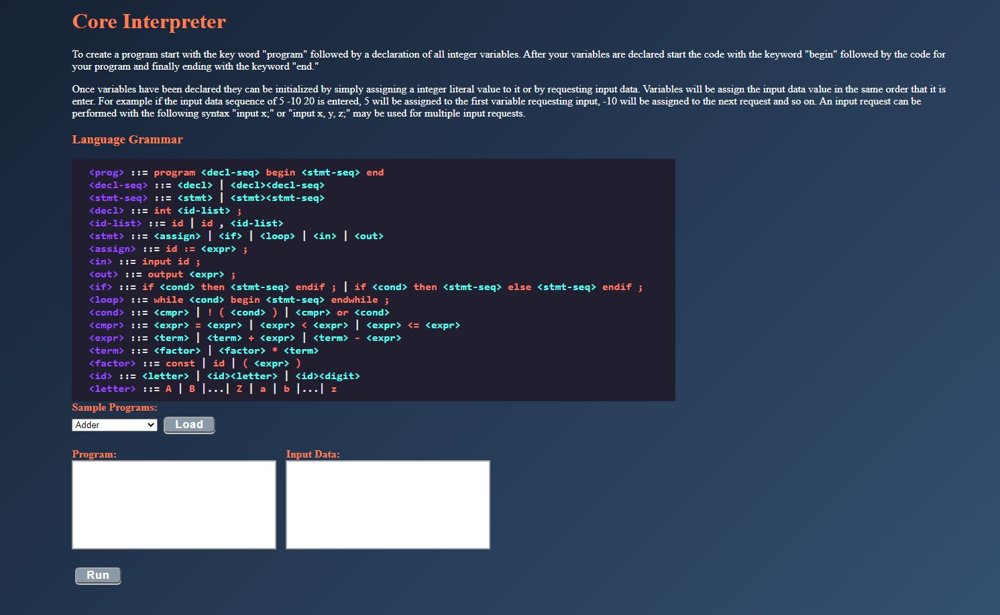
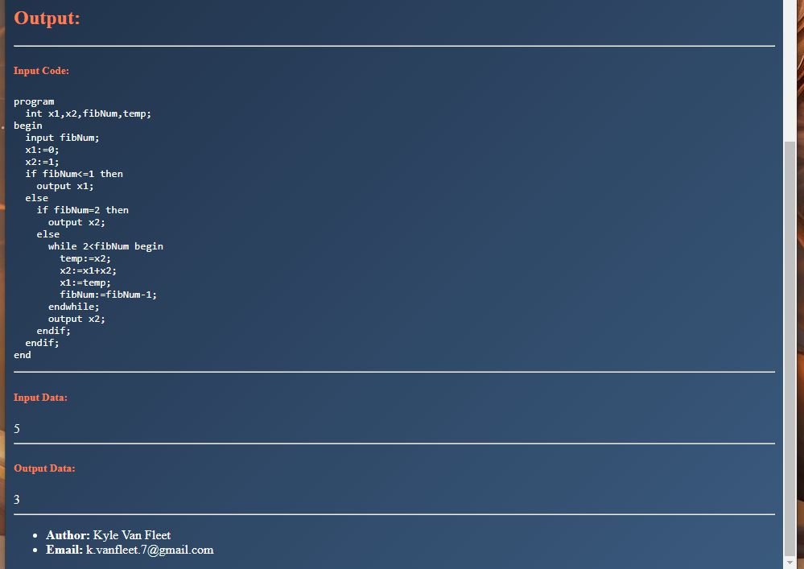

[Home](https://vanfleet0351.github.io/Kyle-Van-Fleet-Portfolio/)

# Custom Programming Language Interpreter
This is a class project for CSE 3341 at the Ohio State University. It is an interpreter for a toy language called Core. Core is an imperative language that supports many features of modern programming such as loops, switch cases, stored variables, output to the console, compile time error reporting, execution time error reporting, etc. 

## About the Project
The interface for this project was created using JSPs and java servlets and the backend of the project was created using java. The project utilizes the MVC pattern and follows proper object oriented principles.
**The interpreter** Three input areas; 
1. The Program text area - Here is where the user will write there program.
1. The Data text area - Signed integer data is enetered here for input to the program. All input data must be seperated by a white space character.
1. The Sample Program drop down selection - The user may select from the list of sample program to run to get a better understanding of how to create their own programs.

The program and data inputs are passed to the **Scanner**, where the lexical analysis is performed, the inputs are read character by character to create a queue of tokens. The Scanner is then passed to the **Parser**, where the syntax analysis is performed. The parser creates a parse tree of the program from the stream of tokens provided by the scanner. The program can then be executed to receive program output to the screen and a formatted version of the program with properspacing and indention is printed to the screen. During execution, program variables are stored and retrieved from a hashtable at runtime to maintain constant time performance.




Core: A Toy Imperative Language
```
    <prog> ::= program <decl-seq> begin <stmt-seq> end
    <decl-seq> ::= <decl> | <decl><decl-seq>
    <stmt-seq> ::= <stmt> | <stmt><stmt-seq>
    <decl> ::= int <id-list> ; 
    <id-list> ::= id | id , <id-list> 
    <stmt> ::= <assign> | <if> | <loop> | <in> | <out> 
    <assign> ::= id := <expr> ;
    <in> ::= input id ; 
    <out> ::= output <expr> ; 
    <if> ::= if <cond> then <stmt-seq> endif ; | if <cond> then <stmt-seq> else <stmt-seq> endif ;
    <loop> ::= while <cond> begin <stmt-seq> endwhile ; 
    <cond> ::= <cmpr> | ! ( <cond> ) | <cmpr> or <cond>
    <cmpr> ::= <expr> = <expr> | <expr> < <expr> | <expr> <= <expr>
    <expr> ::= <term> | <term> + <expr> | <term> – <expr>
    <term> ::= <factor> | <factor> * <term>
    <factor> ::= const | id | ( <expr> )
    <id> ::= <letter> | <id><letter> | <id><digit>
    <letter> ::= A | B |...| Z | a | b | ... | z
```
